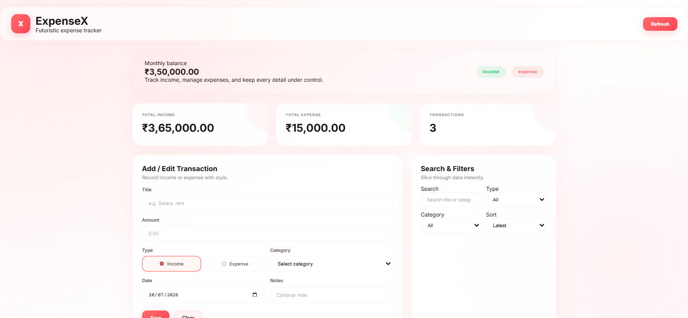
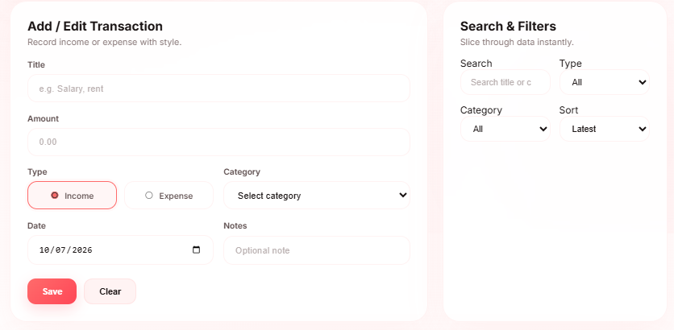
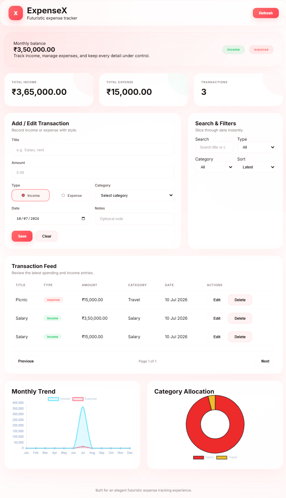
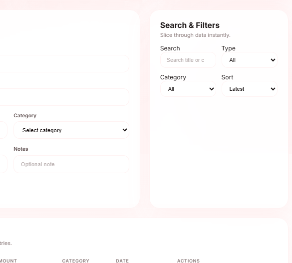
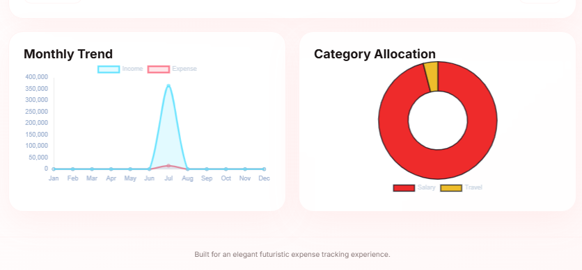

# 💰 Expense Tracker API

A RESTful Expense Tracker API built with **Node.js, Express.js, MongoDB, and Mongoose**. This project allows users to manage their income and expenses with complete CRUD functionality along with advanced features like Search, Filter, Sort, Pagination, and MongoDB Aggregation Reports.

---

## 🚀 Features

### CRUD Operations
- ➕ Add Transaction
- 📄 Get All Transactions
- ✏️ Update Transaction
- ❌ Delete Transaction

### Advanced Features
- 🔍 Search transactions by Title or Category
- 🎯 Filter by Type (Income/Expense)
- 📂 Filter by Category
- ↕️ Sort Transactions
  - Latest
  - Oldest
  - Highest Amount
  - Lowest Amount
- 📑 Pagination
- 📊 Monthly Income & Expense Report
- 📈 Category-wise Expense Report

---

## 🛠 Tech Stack

- Node.js
- Express.js
- MongoDB
- Mongoose
- CORS
- dotenv

---

## 📁 Project Structure

```text
expense-tracker/
│
├── models/
│   └── transaction.model.js
│
├── public/
│   └── index.html
│
├── .env
├── package.json
└── server.js
```

---

## ⚙️ Installation

Clone the repository

```bash
git clone https://github.com/Rahim-Ahmed15/Expense-Tracker.git
```

Install dependencies

```bash
npm install
```

Create a `.env` file

```env
PORT=3000
MONGO_URL=YOUR_MONGODB_CONNECTION_STRING
```

Start the server

```bash
npm start
```

or

```bash
nodemon server.js
```

---

## 📌 API Endpoints

| Method | Endpoint | Description |
|---------|----------|-------------|
| POST | `/api` | Add Transaction |
| GET | `/api` | Get All Transactions |
| PUT | `/api/:id` | Update Transaction |
| DELETE | `/api/:id` | Delete Transaction |
| GET | `/api/search?keyword=salary` | Search |
| GET | `/api/filter?type=expense` | Filter |
| GET | `/api/sort?sort=latest` | Sort |
| GET | `/api/pagination?page=1&limit=5` | Pagination |
| GET | `/api/monthly-report` | Monthly Report |
| GET | `/api/category-report` | Category Report |

---

## 📷 Screenshots

```
screenshots/
│






```

---

## 📚 What I Learned

- REST API Development
- Express.js Routing
- MongoDB & Mongoose
- CRUD Operations
- Search using Regex
- Filtering
- Sorting
- Pagination
- MongoDB Aggregation Pipeline
- Environment Variables
- API Testing with Postman

---

## 🚀 Future Improvements

- React Frontend
- Authentication (JWT)
- Dashboard with Charts
- Export Reports
- Docker Support
- Swagger Documentation
- Unit Testing (Jest)

---

## 👨‍💻 Author

**Rahim Ahmed**

MERN Stack Developer

---

## ⭐ If you found this project helpful, don't forget to give it a Star!